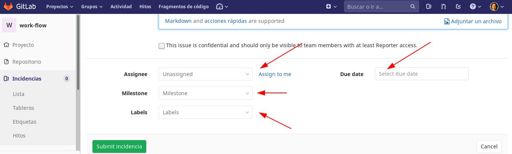

# Propuesta de flujo de trabajo en Gitlab para miembros de Aventura Tech.
## Version 0.1

Este documento tiene como objetivo proporcionar pautas para la integración de código limpio y ordenado; escrito por los miembros de la organización Aventura Tech.

>Este repositorio es un trabajo en progreso. De hecho, su primer "Merge Request" podría ser corregir o agregar nuevas directrices a este documento. Para llevar esto a cabo póngase en contacto con el lider del equipo o con el encargado de "DevOps".

<a name="#inicio"></a>
### Inicio

| Indice |  |
|--|--|
| [General Conventions](#general-conventions) | Convenciones generales |
| [Meaningful Commit Messages](#commit-messages) | Mensajes de confirmación significativos |
| [Basic commands](#basic-commands) | Comandos básicos |
| [Gitlab Workflow](#gitlab-workflow) | Flujo de Trabajo en Gitlab |


<a name="general-conventions"></a>
## General Conventions

Todos los repositorios deben contar con:
- Una rama `master`. Copia fiel de lo que haya en producción.
- Una rama `release`. La rama **Release Candidate** (RC), debe estar disponible en el  **staging environment**.
- Una rama `develop`. La rama de la cuál cada desarrollador sacará sus respectivas ramas personalizadas para `feature` y `fix`.
- Se recomienda usar letras minúsculas en los nombres.
- Se recomienda el uso de guiones ( - ).
- Se recomienda usar nombres identificativos. Ej. *feature-login-facebook*
- Si existen varias personas trabajando en la misma parte, característica o feature del proyecto, puede ser conveniente tener un branch para todo el equipo y otros branches personales para cada persona.

<a name="commit-messages"></a>
## Meaningful Commit Messages
**Estructura del Mensaje**

El mensaje de los commit debe consistir en 3 diferentes partes 
separadas por una linea en blanco: el título, un cuerpo 
opcional y un pie opcional. Algo como lo siguiente:

```
type: subject 

body 

footer
```

El tipo es contenido en el titulo y puede ser de alguno de los siguientes casos:

>`feat:` Una nueva caracteristica\
>`fix:` Se soluciono un bug\
>`docs:` Se realizaron cambios en la documentación\
>`style:` Se aplico formato, comas y puntos faltantes, etc; sin cambios en el código\
>`refactor:` Refactorización del código en producción\
>`test:` Se añadieron pruebas, refactorización de pruebas; sin cambios en el código\
>`chore:` Actualización de tareas de build, configuración del admin, de paquetes; sin cambios en el código

*Subject*

- El titulo consiste en el tipo y asunto del mensaje. 
- No debe tener más de 50 caracteres.
- Debe iniciar con una letra mayuscula y no terminar con un punto.

*Body*

Al escribir el cuerpo (Body), se debe dejar una linea en blanco 
entre el título y el cuerpo, además debemos limitar la longitud 
de cada linea a no más de 72 caracteres.

*Footer*

El pie es opcional al igual que el cuerpo, pero este es usado 
para seguimientos. Ej:

Resolves: #b214c5\
Issues: #03

<a name="#basic-commands"></a>
## Basic Commands

Para guardar los cambios realizados:

```
git add --all
```
ó

```
git add .
```
Para agregar un commit: 

```
git commit -a
```
ó 
```
git commit -am 'Explicacion del commit'
```

Existen casos donde tal vez tengamos x equivocación y queremos volver a intentarlo, podemos usar este comando.
```
git reset --hard HEAD~1
```
Este eliminará nuestro último commit de la rama donde estemos ubicado.
Pero resulta que queremos eliminar el commit pero conservar los cambios, entonces usaremos este otro comando, sin el `--hard`
```
git reset --HEAD~1
```
Lo que ocurrirá es que eliminará el último commit pero en el area de trabajo se mantendrá igual. Usted puede verificar sus cambios con:
```
git status
```

<a name="#gitlab-workflow"></a>
## Gitlab Workflow

Las siguientes especificaciones son exclusivas de la plataforma Gitlab. Y serán aquellas por las que nos guiaremos.

**Consideraciones**

| Que debe hacerse | Detalle | Quien lo hace |
|--|--|--|
| [Crear Proyecto](#crear-proyecto) | Aquí se incluye la creación del repositorio y/o<br /> ramas que se necesitarán.<br /> También puede asignar a alguien más. | [Luigui Astohuamán](@luiguimario) |
| [Crear Incidencias](#crear-incidencias) (`Issues`) | En este paso (el cuál también puede asignarse<br /> a otro/a persona) es donde se dan las<br /> asignaciones a los desarrolladores. | [Luigui Astohuamán](@luiguimario) |
| [Merge Requests](#merge-requests) | Una vez recibidas las asignaciones y, que cada<br /> desarrollador haya descargado su copia del<br />proyecto; deberá crear su propio `Merge Request`<br /> para iniciar su trabajo. | - [Luigui Astohuamán](@luiguimario)<br /> - [Erick Quispe](@ertrii)<br /> - [Gerardo A. Muñoz A.](@gmunozasca)<br />- [Giordano](@giordano200699)<br />- [Ktacas](@Ktacas)<br />- [Luis-QT](@Luis-QT)<br />- [Marco Castilla]( @mact35)<br />- [Fatima D. Galindo V.](@fatimagavi)<br />- [Fredy Astorayme](@FredyAstorayme)<br />- [Pablo E. Pulido](@pulidovpe)<br /> |
| [Aprobar un merge](#aprobar-un-merge) | Esta sección es exclusivamente para el<br /> encargado de revisar el código antes de<br /> hacer el merge. | [Luigui Astohuamán](@luiguimario) |
| [Fusionar los cambios](#fusionar-los-cambios) | Una vez recibida la aprobación ya se puede<br /> realizar la fusión por consola o en *Gitlab*. | - [Luigui Astohuamán](@luiguimario)<br /> - [Erick Quispe](@ertrii)<br /> - [Gerardo A. Muñoz A.](@gmunozasca)<br />- [Giordano](@giordano200699)<br />- [Ktacas](@Ktacas)<br />- [Luis-QT](@Luis-QT)<br />- [Marco Castilla]( @mact35)<br />- [Fatima D. Galindo V.](@fatimagavi)<br />- [Fredy Astorayme](@FredyAstorayme)<br />- [Pablo E. Pulido](@pulidovpe)<br /> |


<a name="#crear-proyecto"></a>
### Crear Proyecto


<a name="#crear-incidencias"></a>
### Crear Incidencias

Para crear una incidencia lo primero es ubicarse en el proyecto donde se trabajará. Luego en el lado izquierdo ubicamos (dependiendo del idioma configurado) la opción Incidencia ó, `Issues`.


Al abrir, nos aparecerá el panel de incidencias, donde ubicado a la derecha podremos crear una nueva.


Al momento de llenar el formulario existen otra consideraciones a saber; las cuales deben completarse antes de crear la incidencia:
- `Assignee`, que es a quién se le asignará la incidencia. Se la puede asignar la misma persona que crea la incidencia.
- `Milestones`, que son los hitos. Es decir, la forma de conocer el avance del proyecto, generalmente identificados con una versión (Ej. v0.0.1).
- `Labels`, es decir, las etiquetas que nos informarán acerca del tipo de incidencia.
- `Due date`, o sea, la fecha de vencimiento.



Al crearse, la persona asignada será notificada por la plataforma.

<a name="#merge-requests"></a>
### Merge Requests

El/la desarrollador(a), deberá ubicarse en la incidencia creada y dar click en el menú desplegable situado a la derecha del botón que permite crear los `Merge Request`.
Una vez abierto, lo siguiente es seleccionar el origen; que por defecto es *master*. Este campo debe ser editado y cambiado por *develop*.


**Aclaración**. Debido a que no estamos usando la versión *GitLab Enterprise Edition*, la `approvals interface` no están disponibles. Por lo tanto, al momento de crear un `merge request` tendrá que agregarse una nota identificativa para la persona que debe revisar y aprobar los cambios.


De esta forma, la persona etiquetada (y notificada) para revisar el código tendrá una forma de confirmar que lo hizo.\
Otra cosa a tomar en cuenta es la modificación (por parte de la plataforma *Gitlab*) del nombre del `merge request` al crearlo, agregándole un prefijo:<br /> **`WIP: Resolve`**


`WIP: Resolve` es el acrónimo de Work In Progress. Y es un indicador de *Gitlab* para notificar que se está trabajando actualmente en ese `merge request`. Además, evitará que hagamos **merge** hasta que no quitemos ese prefijo.

Para bajarse la rama creada por este `merge request` y empezar a trabajar en ella, se recomienda usar la consola.

Lo primero es descargarse el proyecto y ubicarse dentro.

```
git clone git@gitlab.com:aventuratech/work-flow.git

cd work-flow
```
Luego bajarse la rama creada por el `merge request`.
```
git pull

git branch 2-guia-para-workflow origin/2-guia-para-workflow
```
ó ...
```
git fetch origin

git checkout -b 2-guia-para-workflow origin/2-guia-para-workflow
```


Esto les mostrará la información de las ramas remotas. Luego enlazaremos la rama local con la remota.
Sino usaron `git checkout`, no hay que olvidar cambiarse a la rama correspondiente.

```
git checkout 2-guia-para-workflow
```

Una vez hechos los cambios, se recomienda seguir las normas descritas en la sección de [Meaningful Commit Messages](#commit-messages) para detallar la información del *commit* antes de subirlo. Tambien es importante resaltar que la version en la que se trabaja debe estar actualizada, de hacer un commit de una version antigua puede generar conflicto.

<a name="#aprobar-un-merge"></a>
### Aprobar un merge

Además de una revisión personalizada, quien revisa el código cuenta con herramientas en la plataforma, como *diff*.


Mientras hay revisiones, puede existir un diálogo entre quien revisa y quien desarrolla. Para estos casos se recomienda usar la plataforma. De esta forma queda constancia de las decisiones que se van tomando durante el desarrollo.


Una vez revisado el código; hay que dar la aprobación en *Gitlab*.
La persona etiquetada, debería marcar el *checklist* que se encuentra bajo el título del `merge request` y dar click en el botón **Resolve WIP status**.
Una vez hecho esto, puede dejar que la fusión la haga el propio desarrollador(a) ó, hacerla por usted mismo. 


<a name="#trabajo-en-equipo"></a>
### Trabajo en equipo

Al trabajar en equipo, los `merge request` hechos por cada desarrollador, al ser aprobados y fusionados; pueden ocasionar conflictos con los que alguien que aún no los sube, si no se tienen los últimos cambios.
Para estos casos se sugiere, antes de subir los cambios; ejecutar un `git fetch` en lugar de un `git pull`. De esta forma se tendrá la ultima versión de la rama *develop* antes de subir nuestros cambios.
Para no perder los cambios que se encuentren en el *stage* se recomienda usar `git stash` para guardarlos. 
Luego deben fusionarse en la rama del `merge request` con el siguiente comando:
```
git merge -s recursive -X theirs develop
```
Finalmente, al hacer el merge podremos recuperarlos con un `git stash apply`. Y nuestros cambios quedarán listos para agregarlos y subirlos para revisión y posterior fusión.


<a name="#fusionar-los-cambios"></a>
### Fusionar los cambios

Existen dos maneras de cerrar el `merge request`. Desde la plataforma de *Gitlab* y desde la consola (lo cual recomendamos).
Desde *Gitlab*, luego de marcar los *checklist* `Eliminar rama origen` y `Squash commits`. Desde aquí, evitamos hacer un *fast-forward* y eliminamos la rama del repositorio origen.


Y desde la consola, teniendo cuidado de no permitir un *fast-forward* y previniendo así algún conflicto de versiones.
Ya ubicados en la rama correspondiente:

```
git fetch origin

git checkout origin/develop

git merge --no-ff 2-guia-para-workflow
```
Y luego subiendo los cambios a la rama *develop*.

```
git push origin develop
```
Para borrar la rama remota:
```
git push origin --delete 2-guia-para-workflow
```

### Manejando las Etiquetas

Una etiqueta sirve para tener un nombre mas fácil de recordar un commit, sirve como un sobrenombre para apuntar hacia ahí.

Para crear una etiqueta con descripción

```
git tag -a nombre_etiqueta -m "mensaje de la etiqueta"
```
Para listar todas las etiquetas en orden alfabético
```
git tag
```


#### [Volver al inicio](#inicio)