#  Introducción a la cultura `DevOps` y puesta en práctica para el correcto desarrollo del proyecto.
## Version 0.1

Este documento tiene como objetivo proporcionar pautas para la integración, entrega y despliegue contínuo (`CI/CD`) del código desarrollado por los miembros de la organización Aventura Tech.

>Este repositorio es un trabajo en progreso. De hecho, su primer "Merge Request" podría ser corregir o agregar nuevas directrices a este documento. Para llevar esto a cabo póngase en contacto con el lider del equipo o con el encargado de "DevOps".

#### Inicio

| Indice |
|--|
| [¿Que es `DevOps`?](#devops) |
| [Empezando](#empezando) |
| [Los entornos](#los-entornos) |
| [El entorno Develop](#el-entorno-develop) |
| [El entorno Staging](#el-entorno-staging) |
| [El ciclo completo](#el-ciclo-completo) |
| [Los Cherry Pick](#los-cherry-pick) |
| [Donde ver los entornos](#donde-ver-los-entornos) |
| [Donde ver el Frontend](#donde-ver-el-frontend) |
| [Donde ver el Backend](#donde-ver-el-backend) |
| [Como crear un `Release`](#como-crear-un-release) |

## `DevOps`

DevOps es una filosofía que conlleva un cambio cultural con la finalidad de entregar software más rápido.

Este cambio pasa por eliminar la tradicional distancia entre programadores y administradores de sistemas y permitir así despliegues más frecuentes con menos problemáticas. A este proceso a menudo se le llama desarrollo ‘casi a tiempo real’ o desarrollo agile, porque permite a los desarrolladores levantar entornos para desplegar código de forma rápida y sencilla cada vez que lo necesitan. En esta mecánica, la automatización es un elemento clave, pero no el único.

 

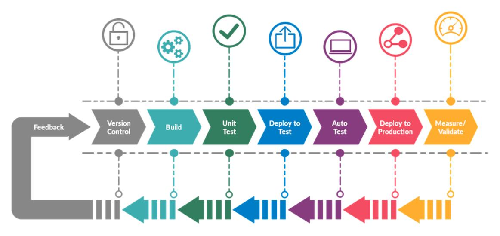

 

#### [Volver al inicio](#inicio)

## Empezando

El proceso de desarrollo de software en cada empresa es diferente. Si se adopta la cultura `DevOps`, no significa que se seguirá una receta única que todas las empresas siguen.
Cada caso es distinto, pero si se siguen buenas prácticas y se adopta esta cultura en el proceso de desarrollo de software; alcanzaremos los objetivos propuestos de la mejor manera posible.

### Recomendaciones acerca de los test

- Cada nuevo `feature` en desarrollo debe (posteriormente) contar con su `Unit Test`.
- Antes de subir código que forme parte de la lista de *quehaceres* de un `Issue` (salvo que que el líder de equipo indique lo contrario) se recomienda desarrollar y ejecutar dichos test en su *servidor local*.
- No olvidar usar la respectiva bandera para `coverage` y así ver los reportes detallados.
- Los `Integration Test` también son importantes.
- Preparar entornos de servidores locales para ejecutar sus pruebas.

### Para los líderes de equipo

- Durante su revisión a los `merge request`, hacer *code review*. Es decir, comentar el código revisado en la plataforma de Gitlab.
- Mantener comunicación al día con el encargado de `DevOps` en caso de despliegues.
- Notificar cada vez que se desee desplegar una versión de prueba o `artifact` en el entorno de *Desarrollo* y así comprobar features y realizar test al API.
- Para los casos de despliegue de APIs que necesiten variables de entorno en un archivo `.env` deben dirigirse al encargado de `DevOps` y notificarle acerca de las mismas.

#### [Volver al inicio](#inicio)

## Los entornos

Los entornos de trabajo, preparados en el `pipeline`; se despliegan de forma automática en la plataforma de Amazon Web Services.  
Para el caso de proyectos estáticos diseñados específicamente para el *frontend* se utilizarán Buckets S3 con una *URL* fija. Dichos buckets se desplegarán automáticamente al ejecutarse el `pipeline`; y será eliminado su contenido (deteniendo el entorno de forma manual) una vez concluidas las pruebas. 

>Si al momento de desplegar un nuevo entorno, todavía se encuentra funcionando una instancia (Bucket S3 o EC2), ésta será eliminada y sustituida por la nueva automáticamente. 

En cuanto a los proyectos tipo *backend* cuya configuración es mas exigente; se usará una Instancia EC2 (también en Amazon) generada automáticamente para este único fin. 
Dicha instancia, tendrá todo el software requerido para que el entorno pueda ejecutarse sin problemas y las pruebas se realicen el tiempo que sea necesario.  
Además, la instancia ya estará configurada y tendrá acceso una base de datos RDS en *Postgre* (también alojada en Amazon) a la cual tienen acceso los integrantes del equipo del *Backend* para poder realizar sus pruebas.

 

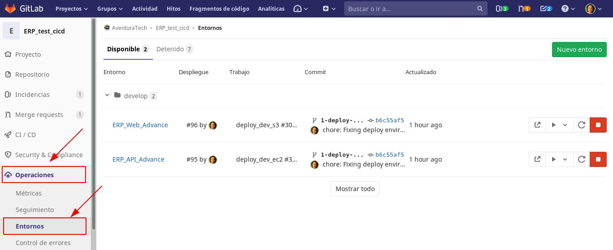

 

La instancia también podrá ser detenida y eliminada de forma manual desde página del `pipeline`, del `merge-request` y de los entornos por parte de los desarrolladores.

 

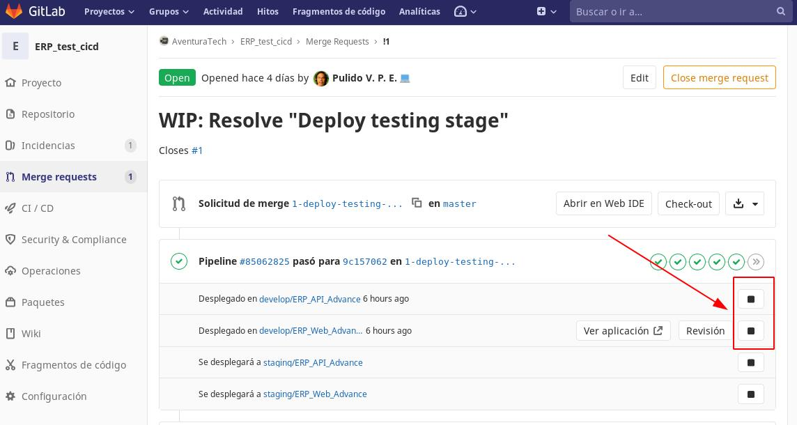

#### [Volver al inicio](#inicio)

## El entorno Develop

En los entornos desplegados los equipos de desarrollo pueden comprobar el avance de su trabajo. Pueden comprobar su diseño y desempeño. Y en caso de ser un API, pueden realizar pruebas con una aplicación como *Postman*, *Swagger Inspector*, *Insomnia*, entre otros. 
Además de los entornos que tengan en sus computadoras personales, contarán con este entorno remoto para poder ver el avance de su trabajo y saber si está listo para generar un `release` y ser desplegado en el siguiente entorno (*Staging*) ó, hacer correcciones en el código. 
Este entorno, servirá para que todo el equipo de desarrollo pueda hacer pruebas integrales al completar un `Sprint` (Front y Back), de no encontrarse ningun inconveniente el lider del equipo de desarrollo le comunicará al equipo de `QA` que pueden trasladar dicha versión al ambiente de *Staging* para su revisión posterior.

 

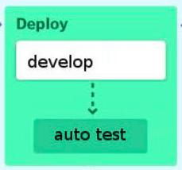

#### [Volver al inicio](#inicio)

## El entorno Staging

En estos entornos, suelen desplegarse los `releases`. Generalemente al completar un `Sprint`. Aunque no siempre; en ocasiones pueden hacerse despliegues en este entorno antes de finalizar un `Sprint`. 
Este entorno cuenta con todas las ventajas del entorno *Develop*, sólo que estará reservado para el equipo de `QA`, también conocido como *Quality Assurance*. 
En este caso el equipo estará conformado por [Luigui Astohuamán](@luiguimario), [Marco Castilla]( @mact35) y [Pablo E. Pulido](@pulidovpe).
No se desplegará de forma automática, sinó de forma manual. Se ejecutará en otras instancias reservadas para tal fin. E incluso, usará otra base de datos RDS. 
No está demás decir que, las pruebas que se efectuarán en este entorno; deben ser superadas y aprobadas por el equipo de `QA` para poder hacer despliegues en *producción*.

 

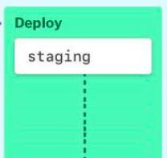

#### [Volver al inicio](#inicio)

## El ciclo completo

El ciclo de desarrollo, cuando se encuentra bien organizado, siguiendo *metodologías ágiles* puede representarse así desde el punto de visto de `DevOps`.
A continuación una representación del ciclo completo de desarrollo en nuestro `Pipeline`:

 

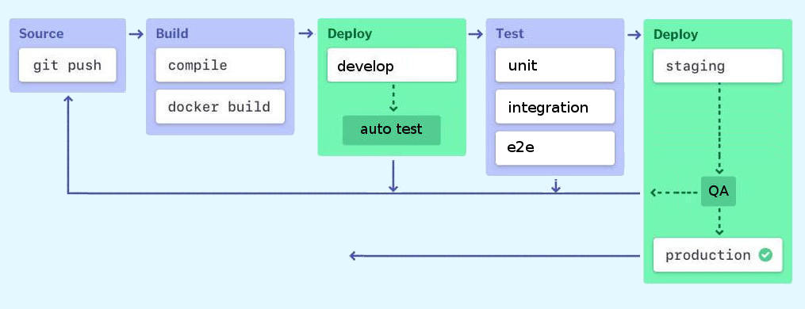

  

- Luego de una buena preparación, planificación y levantamiento de información iniciamos con el desarrollo. Lo llamaremos `Source`. Aquí es donde los equipos de desarrollo contruyen el software, hacen sus pruebas locales y finalmente, lo suben al repositorio.
   - También es aquí es donde inicia el proyecto **monorepo**. Se genera un **issue** y posteriormente un **Merge request** donde se desplegarán los proyectos en desarrollo.
   - Cualquier uso de **Variables de Entorno** que se requiera para la correcta ejecución del proyecto, deberá ser notificada al encargado de *DevOps* para que se incluyan en la configuración del `pipeline`.
- Al subirlo, se debe obtener el código de los proyectos (back y front) para clonarlo, instalar dependencias y construirlo. Lo llamaremos `Build`.
   - De ocurrir algún problema durante la construcción de los *artefactos* y se determine que se debe a un error en el código de los proyectos; se les notificará a los líderes de equipo mediante el sistema de comentarios del **merge request** (en el monorepo del `pipeline`) generado en la plataforma de **Gitlab**.
- Una vez realizados los procesos de compilación, pasaremos al despliegue de los entornos (`Deploy`). En él, se crearán nuevas instancias para trabajar (tanto S3 como EC2) y de existir aún las anteriores, éstas se eliminarán.
   - El primer despliegue es **Develop**. En él, los equipos de desarrollo efecturán diversas pruebas y comprobarán como se comporta su aplicación en un entorno parecido al de **Production**. Si el resultado es satisfactorio, será el momento para crear un *release* y pasarlo al siguiente entorno, el cual sólo puede ser desplegado por *QA*. Caso contrario, deberán volver al inicio del ciclo.
   - Debido a particularidades de las librerías usadas para realizar los test, estos se colocarán despues del despliegue de **Develop**. Iniciarán de forma automática los diversos *test* que se encuentren configurados (unitarios, de integración, e2e). A este paso lo nombramos `Test`. No está demás decir, que si no son superadas las pruebas, todo el proceso se detendrá y se deberá volver al inicio del ciclo.
   - También se utilizará la plataforma de comentarios en el **Merge request** (en el monorepo del `pipeline`) para notificar sobre cualquier error ocurrido durante los *Test* realizados durante la ejecucion de los *Jobs*.
   - Los líderes deberán crear primero un **Issue** y luego un **Merge request** de la rama *release*.
   - Una vez descargado el **Merge request** de la rama *release*, deben hacer un git fetch y luego un merge trayéndose los cambios de *develop* a la rama *release*.
   - Cabe mencionar que, se debe dejar constancia de cada paso que se de, en el sistema de comentarios del **Merge request** (en el monorepo del `pipeline`).
   - Para este momento, el `pipeline` del monorepo tomará el código de la rama *release* de los proyectos para que sean desplegados en **Staging**.
   - En el caso de que QA encuentre algún error en el *Sprint* notificará a *Desarrollo* a través de los comentarios del **Merge request** (en el monorepo del `pipeline`) para que solucionen el error mediante el uso de `Hotfixes` en la rama *release*.
   - Después que los líderes de *Desarrollo* resuelvan el `Hotfix` (es decir, el **Issue** de la rama *release*) con un **Merge request**, deberán ejecutar un **Cherry-pick** a la rama *develop* del commit que se haya usado para resolver el error detectado por QA.
   - Esto se puede hacer desde la misma pantalla del **Merge request**. Hay un boton justo al lado para tal fin.
   - QA lo revisa, si se aprueba, se dan indicaciones para hacer **Merge request** a *master* en los respectivos proyectos.
   - Quedará de parte de *QA*, decidir si preparar un nuevo despliegue, a **Production**, para mostrarlo al cliente, el cual; tendrá la palabra final sobre su aceptación o modificación (volver al inicio del ciclo).

#### [Volver al inicio](#inicio)

## Los Cherry-pick

Para efectuar los **Cherry-pick** que se mencionan durante el ciclo completo, debemos dirigirnos a la pantalla del **Merge request** que se haya realizado en la rama *Release*.

 

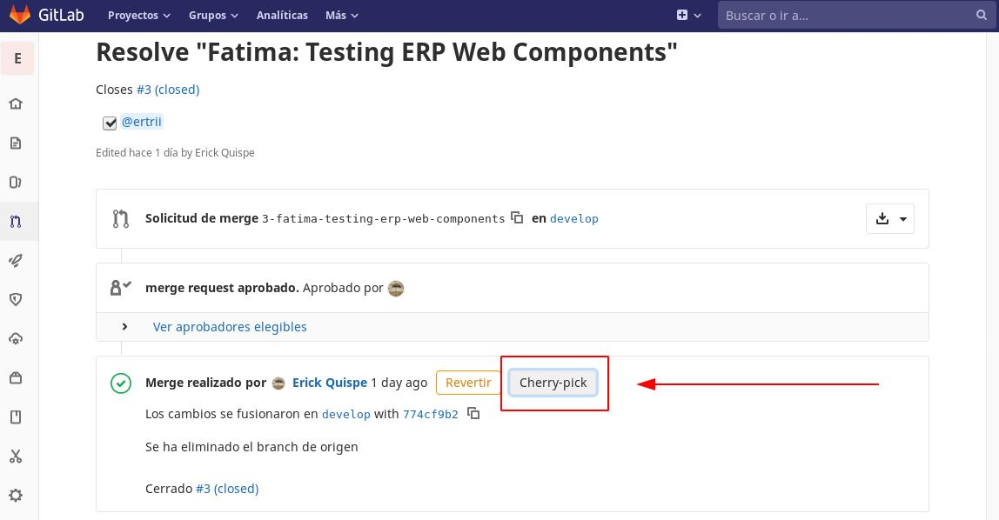

 

Una vez presionado el botón del **Cherry-pick** aparecerá un modal solicitando se seleccione la rama en la que se implementará. La cual deberá ser, *Develop*.

 

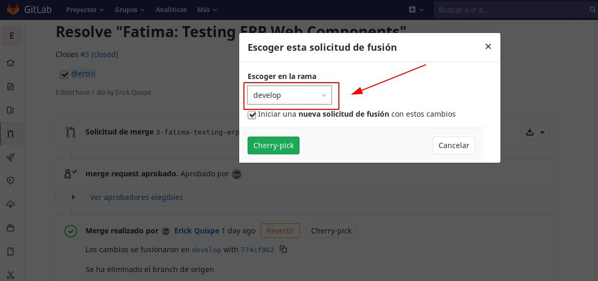

#### [Volver al inicio](#inicio)

## Donde ver los entornos

Una vez recibida la notificación del encargado de `DevOps` para ver los entornos desplegados del proyecto en desarrollo hay que dirigirse a la plataforma de Gitlab, específicamente al último `merge request` abierto del proyecto designado para tal fin (`monorepo`).
Desde el enlace señalado se podrá acceder al entorno del proyecto desplegado.

#### [Volver al inicio](#inicio)

## Donde ver el *frontend*

Los entornos estarán identificados con los nombres de los proyectos, pero llevarán delante un prefijo; el tipo de entorno seguido por un *slash* o barra diagonal. Cada equipo de desarrollo conoce las características y el propósito para el cual están construyendo su proyecto. 
En el caso del *frontend*, debido al hecho de ser desplegado en un Bucket S3 (cuya dirección no cambia), siempre se mostrará una URL desde donde acceder. Tanto en la pantalla del `merge request`, como en la del `pipeline` o la de los `entornos`.

 

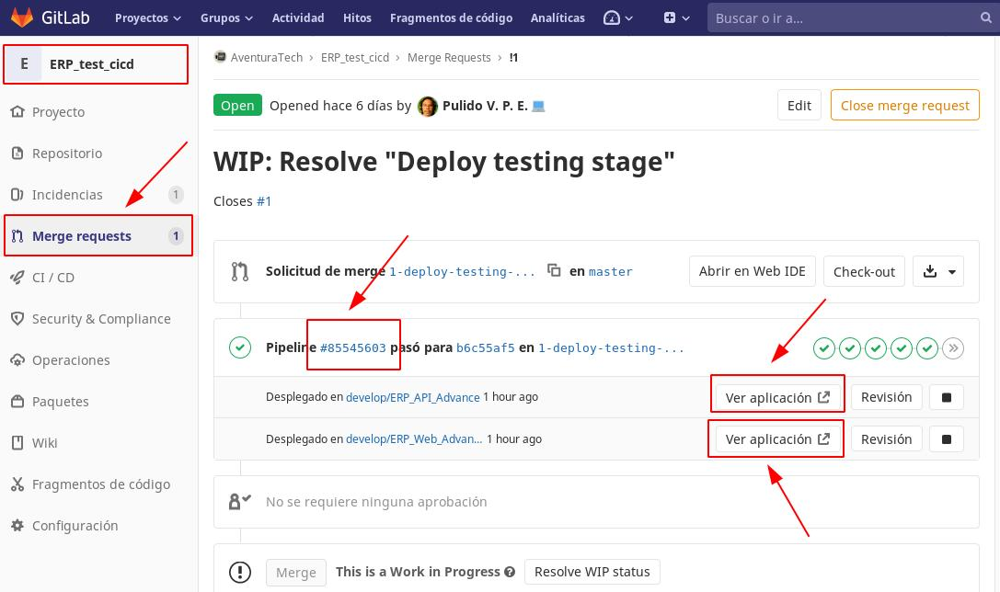

 

Dando click en el número de `pipeline` podremos desplazarnos directamente a la página donde se detallan los `Jobs` ejecutados.

 

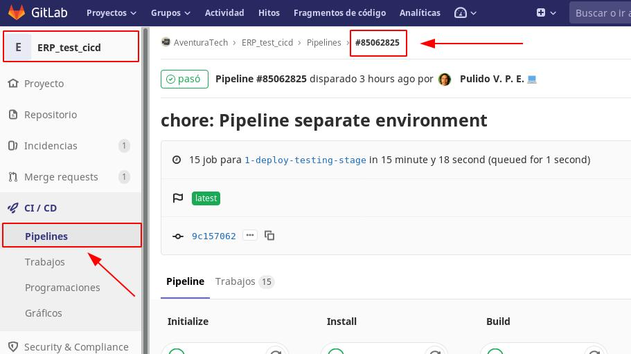

 

A continuación la totalidad de los `Jobs` ejecutados sin incluir **production**.

 

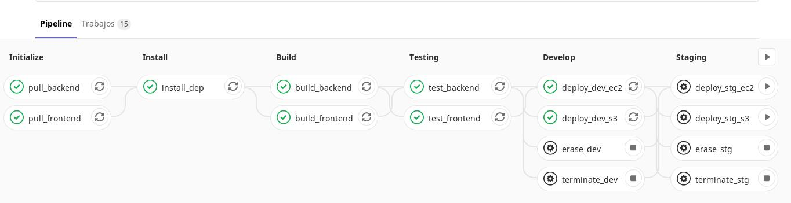

#### [Volver al inicio](#inicio)

## Donde ver el *Backend*

Cuando un proyecto sea de `backend` y posea un API que consumir también se desplegará un entorno. 
En aquellos casos en que dicho entorno no muestre una URL publicada en la pantalla del [`merge request`](#donde-ver-el-entorno), deberemos dirigirnos al `pipeline` y dar click en el `Job` de despliegue de la instancia EC2.

> De momento, no se poseen IPs estáticas para los entornos.

 

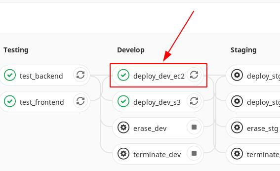

 

Luego que estemos ahí, vamos al final de la página donde deberemos ver tanto el DNS público como la ip.

 

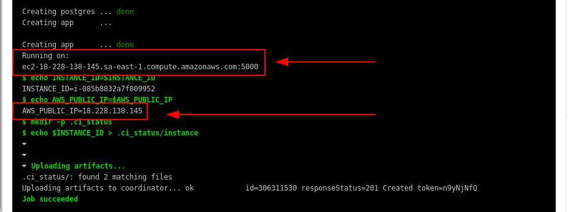

#### [Volver al inicio](#inicio)

### Como crear un `Release`

1 - Ir al repositorio.
2 - En el menú elegir Repositorio > Etiquetas
3 - Agregar una etiqueta para la versión de la aplicación. Por ejemplo, v1.2.
4 - Agregar un mensaje (título) acerca del `release`. Por ejemplo, Release 1.2.
5 - Agregar una nota para describir los detalles del `release`. (Es obligatorio. Agregar una nota a la etiqueta, es lo que lo convierte en un `release`.)
6 - Hacer Click en Crear Etiqueta.

 

