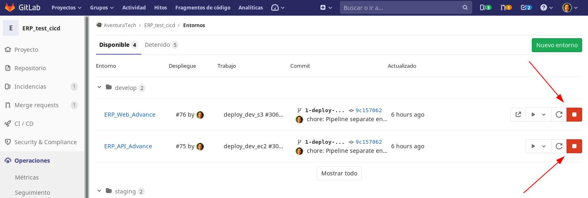

# Propuesta para un flujo de trabajo ordenado en el desarrollo, pruebas en entornos organizados, revisión de código y posterior publicación de `releases`; siguiendo la cultura `DevOps` en la plataforma Gitlab para miembros de Aventura Tech.
## Version 0.1

Este documento tiene como objetivo proporcionar pautas para la integración, entrega y despliegue contínuo (`CI/CD`) del código desarrollado por los miembros de la organización Aventura Tech.

>Este repositorio es un trabajo en progreso. De hecho, su primer "Merge Request" podría ser corregir o agregar nuevas directrices a este documento. Para llevar esto a cabo póngase en contacto con el lider del equipo o con el encargado de "DevOps".

### Inicio

| Indice |
|--|
| [¿Que es `DevOps`?](#devops) |
| [Empezando](#empezando) |
| [Donde ver el entorno](#donde-ver-el-entorno) |
| [Donde ver el API](#donde-ver-el-api) |
| [Los entornos](#los-entornos) |
| [El entorno Develop](#el-entorno-develop) |
| [El entorno Staging](#el-entorno-staging) |
| [El ciclo completo](#el-ciclo-completo) |

## `DevOps`

DevOps es una filosofía que conlleva un cambio cultural con la finalidad de entregar software más rápido.

Este cambio pasa por eliminar la tradicional distancia entre programadores y administradores de sistemas y permitir así despliegues más frecuentes con menos problemáticas. A este proceso a menudo se le llama desarrollo ‘casi a tiempo real’ o desarrollo agile, porque permite a los desarrolladores levantar entornos para desplegar código de forma rápida y sencilla cada vez que lo necesitan. En esta mecánica, la automatización es un elemento clave, pero no el único. 

<a name="#inicio">
Volver al inicio
</a>

## Empezando

El proceso de desarrollo de software en cada empresa es diferente. Si se adopta la cultura `DevOps`, no significa que se seguirá una receta única que todas las empresas siguen.
Cada caso es distinto, pero si se siguen buenas prácticas y se adopta esta cultura en el proceso de desarrollo de software; alcanzaremos los objetivos propuestos de la mejor manera posible.

### Recomendaciones acerca de los test

- Cada nuevo `feature` en desarrollo debe (posteriormente) contar con su `Unit Test`.
- Antes de subir código que forme parte de la lista de *quehaceres* de un `Issue` (salvo que que el líder de equipo indique lo contrario) se recomienda desarrollar y ejecutar dichos test en su *servidor local*.
- No olvidar usar la respectiva bandera para `coverage` y así ver los reportes detallados.
- Los `Integration Test` también son importantes.
- Preparar entornos de servidores locales para ejecutar sus pruebas.

### Para los líderes de equipo

- Durante su revisión a los `merge request`, hacer *code review*. Es decir, comentar el código revisado en la plataforma de Gitlab.
- Misma recomendación a los demás desarrolladores.
- Mantener comunicación al día con el encargado de `DevOps` en caso de despliegues.
- Notificar cada vez que se desee desplegar una versión de prueba o `artifact` en el entorno de *Desarrollo* y así comprobar features y realizar test al API.
- Para los casos de despliegue de APIs que necesiten variables de entorno en un archivo `.env` deben dirigirse al encargado de `DevOps` y notificarle acerca de las mismas.

<a name="#inicio">
Volver al inicio
</a>

## Donde ver el entorno

Una vez recibida la notificación del encargado de `DevOps` para ver los entornos desplegados del proyecto en desarrollo hay que dirigirse a la plataforma de Gitlab, específicamente al último `merge request` abierto del proyecto designado para tal fin (`monorepo`).
Desde el enlace señalado se podrá acceder al entorno del proyecto desplegado. 

Dando click en el número de `pipeline` podremos desplazarnos directamente a la página donde se detallan los `Jobs` ejecutados.

A continuación la totalidad de los `Jobs` ejecutados sin incluir *produccion*.

<a name="#inicio">
Volver al inicio
</a>

## Donde ver el API

Cuando un proyecto sea de `backend` y posea un API Rest que consumir también se desplegará un entorno. 
En aquellos casos en que dicho entorno no muestre una URL publicada en la pantalla del [`merge request`](#donde-ver-el-entorno), deberemos dirigirnos al `pipeline` y dar click en el `Job` de despliegue de la instancia EC2.

> De momento, no se poseen IPs estáticas para los entornos.

Luego que estemos ahí, vamos al final de la página donde deberemos ver tanto el DNS público como la ip.

<a name="#inicio">
Volver al inicio
</a>

## Los entornos

Los entornos de trabajo, preparados en el `pipeline`; se despliegan de forma automática (o manual) en la plataforma de Amazon Web Services. 
Para el caso de proyectos estáticos diseñados específicamente para el *frontend* se utilizarán Buckets S3 con una *URL* fija. Dichos buckets se desplegarán al ejecutarse el `pipeline`; y será eliminado su contenido (deteniendo el entorno de forma manual) una vez concluidas las pruebas.\
En cuanto a los proyectos tipo *backend* cuya configuración es mas exigente; se usará una Instancia EC2 (también en Amazon) generada automáticamente para este único fin.
Dicha instancia, tendrá todo el software requerido para que el entorno pueda ejecutarse sin problemas y las pruebas se realicen el tiempo que sea necesario.\ 
Además, dicha instancia ya estará configurada y tendrá acceso una base de datos RDS en *Postgre* (también alojada en Amazon) a la cual tienen acceso los integrantes del equipo del *Backend* para poder realizar sus pruebas.

La instancia también podrá ser detenida y eliminada de forma manual desde página del `pipeline`, del `merge-request` y de los entornos por parte de los desarrolladores.

<a name="#inicio">
Volver al inicio
</a>

## El entorno Develop

En los entornos desplegados los equipos de desarrollo pueden comprobar el avance de su trabajo. Pueden comprobar su diseño y desempeño. Y en caso de ser un API, pueden realizar pruebas con una aplicación como *Postman*, *Swagger Inspector*, *Insomnia*, entre otros.\
Además de los entornos que tengan en sus computadoras personales, contarán con este entorno remoto para poder ver el avance de su trabajo y saber si está listo para generar un `release` y ser desplegado en el siguiente entorno ó, hacer correcciones en el código.

<a name="#inicio">
Volver al inicio
</a>

## El entorno Staging

En estos entornos, suelen desplegarse los `releases`. Generalemente al completar un `Sprint`. Aunque no siempre; en ocasiones pueden hacerse despliegues en este entorno antes de finalizar un `Sprint`.
Este entorno cuenta con todas las ventajas del entorno *Develop*, sólo que estará reservado para el equipo de `QA`, también conocido como *Quality Assurance*.\
En este caso el equipo estará conformado por [Luigui Astohuamán](@luiguimario), [Marco Castilla]( @mact35) y [Pablo E. Pulido](@pulidovpe).
No se desplegará de forma automática, sinó de forma manual. Se ejecutará en otras instancias reservadas para tal fin. E incluso, usará otra base de datos RDS.\
No está demás decir que, las pruebas que se efectuarán en este entorno; deben ser superadas y aprobadas por el equipo de `QA` para poder hacer despliegues en *producción*.

<a name="#inicio">
Volver al inicio
</a>

## El ciclo completo

A continuación una representación del ciclo completo de desarrollo:

<a name="#inicio">
Volver al inicio
</a>

## Que sigue